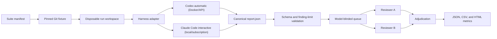

# Architecture

## Boundaries

The semantic prompt and report schema are shared. An adapter may only change launch, output transport, and telemetry collection. Model IDs are held in profiles and never inserted into the assessment instructions or report.

Each run clones a cached fixture into a fresh workspace. Codex runs in Docker: the workspace is mounted read/write, benchmark code is read-only, Linux capabilities are dropped, and outbound traffic passes through a provider allowlist proxy. Claude Code runs locally because the benchmark intentionally uses interactive subscription authentication rather than API billing.

The supplied image pins Codex CLI 0.142.4. Claude profiles require Claude Code 2.1.198, and the generated launch command verifies it before starting. Treat CLI upgrades as benchmark-version changes.

Codex provider credentials are visible to its harness container. Claude runs target commands under the local subscription session. This framework is not a hostile-code malware sandbox: use trusted fixtures and a disposable benchmark workstation or VM.

## Artifacts

Every run preserves `prompt.txt`, `run.json`, raw harness events, `report.json`, and `COMPLETED`. `run.json` stores model identity and cost metadata; the model-generated report never does. Review queues receive randomized blind IDs, while the private map is only consumed after adjudication.
